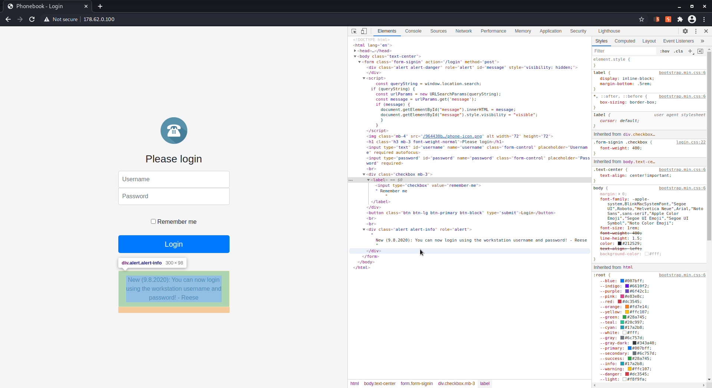
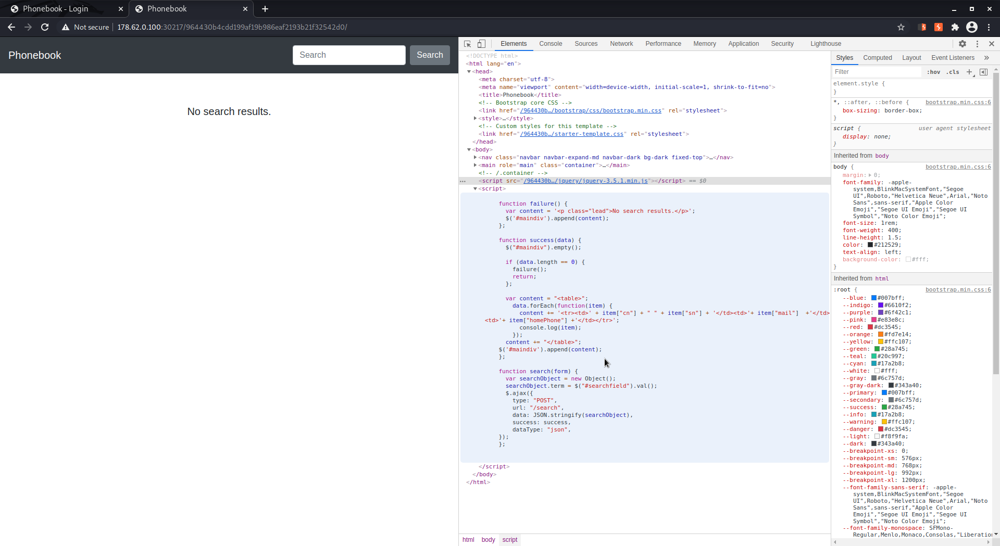
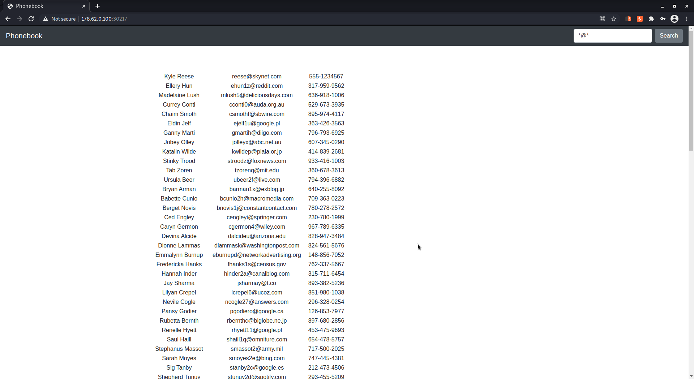

[Ldap attributes](https://github.com/swisskyrepo/PayloadsAllTheThings/blob/master/LDAP%20Injection/Intruder/LDAP_attributes.txt)

[Ldap injection](https://book.hacktricks.xyz/pentesting-web/ldap-injection)

[More Ldap injection](https://www.netsparker.com/blog/web-security/ldap-injection-how-to-prevent/)

bypass login with:
*
*

search in phonebook with *@*... all contacts from the agenda



i didnt found anything

googling... password is the flag -_-

lets make an script: files/crack.py

output:

```
<Response [200]>
MTYwOTY4NTUwOXxEdi1CQkFFQ180SUFBUkFCRUFBQUpfLUNBQUVHYzNSeWFXNW5EQW9BQ0dGMWRHaDFjMlZ5Qm5OMGNtbHVad3dIQUFWeVpXVnpaUT09fOBC-EnYdymO1izf9SzRYAsGjQmddZcJ5cuojVLga3z6
HTB{d1rectory_h4xx0r_is_k00l}
```

